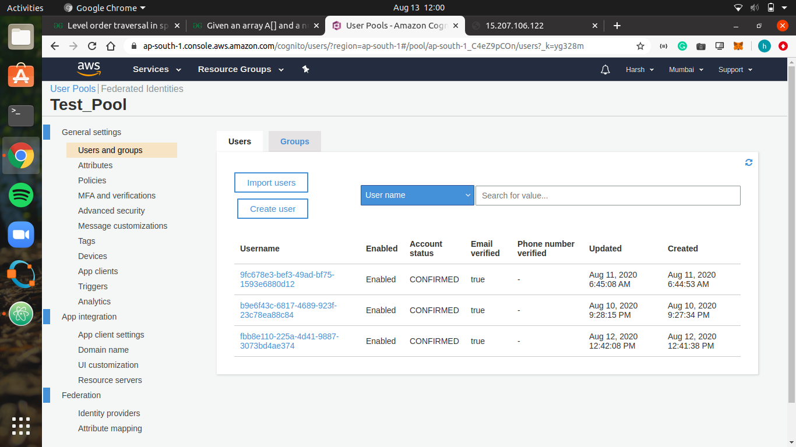

# AmazonCognito_Assginment

This project aims at deploying a node.js app on top of nginx on ec2 instance. The authenticationa and access management of the use is done with the help of amazon cognito.
Amazon cognito handles the authentication process making it easy for the developer.

After login, User is taken to the dashboard and logs are shown to the user. Well, nginx logs are usually stored in /var/log/nginx/ folder.
I created a cron job there so the logs gets update in the file regularly at given instance of time. In Node.js, fs.watch() take care of any update to the file. If any update
is seen then the web page is loaded with the new contents.

I am attaching few screenshot of the project.

# Login

# SingUp

# UserAndGroup

# Logs

Logs can be filter using IP address or TimeStamp. I haven't done assuming it to be a Demo.

